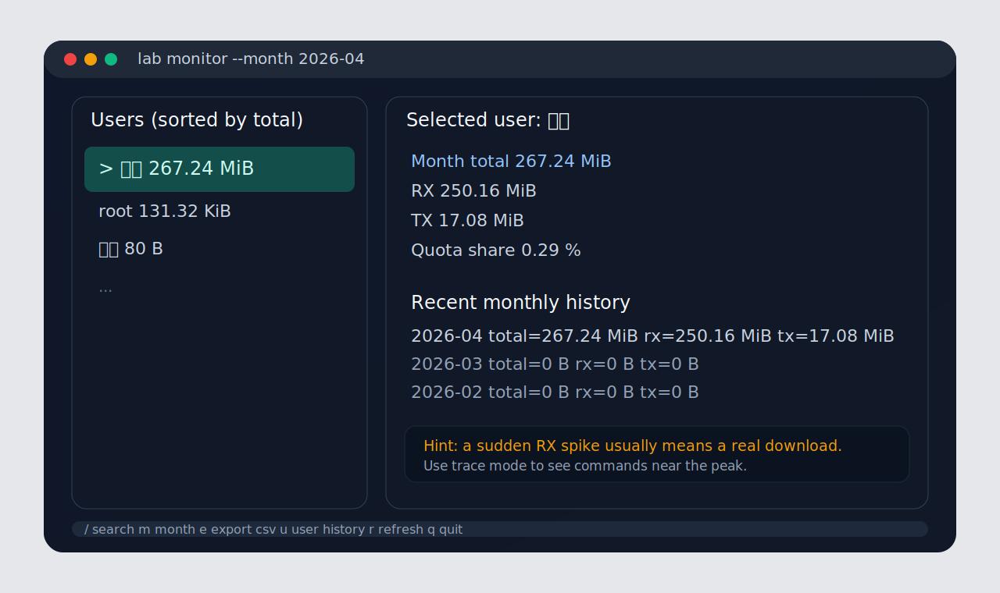

# Labflow

<p align="center">
  <strong>面向实验室共享服务器的按用户月度外网流量统计工具</strong><br/>
  自动识别 <code>/datas</code> 下的用户目录 owner，按 UID 统计从每月 1 号到现在的外网流量，并保留历史记录。
</p>

<p align="center">
  
  
  
  
</p>

如果你的服务器是多人共用、每个月有总流量额度、又希望知道“到底是谁用掉了多少外网流量”，`Labflow` 就是为这个场景做的。

## 为什么会有这个项目

很多实验室服务器都会遇到同一个问题：

- 机器是多人共用的，但外网流量额度按整机算
- 想知道从每月 1 号到现在，每个用户分别用了多少流量
- 月底要自动重新开始统计，但历史还得保留
- 日常想快速看排行榜，排查谁突然出现异常流量

`Labflow` 的设计目标就是：部署一次，之后日常只需要输入 `lab monitor`。

## 核心能力

- 自动扫描 `data_root` 下的用户目录，默认适合 `/datas/<用户名>` 结构
- 根据目录 owner 识别 UID，按 UID 做月度外网流量统计
- 只统计指定外网网卡，不把本机内部通信混进去
- 按自然月聚合，历史月报自动保留，不需要手动清零
- 提供 `report`、`top`、`history`、`export-csv`、`check-quota` 等命令
- 提供 `trace` 命令，排查某个流量突增时段附近执行过什么命令
- 支持“单日超过阈值自动发邮件”，适合盯异常用户
- 提供全屏终端监控界面，支持方向键上下选择、搜索、导出和切换月份
- 提供系统级 `lab` 启动命令，任何目录都能直接打开

## 界面预览

下面是项目内置 TUI 和 CLI 的示意图，实际内容会根据你的服务器数据变化。

| 全屏监控 | 排行与报表 |
| --- | --- |
|  |  |

## 适用前提

部署前先确认下面几点：

- 服务器是 Linux，且有 `Python 3.10+`、`nftables`、`systemd`
- 你有 root 权限，至少能执行一次安装脚本
- 每个用户最好有独立 Linux UID
- 用户目录结构类似 `/datas/<用户名>`
- 你知道服务器的外网接口名，例如 `eth0`、`ens2f2`

不太适合的情况：

- 多个人共用同一个 Linux 账号
- 只靠目录名区分人，但实际任务都跑在同一个 UID 下
- 你需要和校园网网关结算做到字节级完全一致

一句话：`Labflow` 统计的是“本机用户 UID 在外网接口上的实际流量”，适合做实验室内部审计、排行和预警；如果学校最终结算看的是 `ipgw s` 或其他网关账单，请把它当成非常接近的本机侧观测，而不是官方计费系统本身。

## 5 分钟快速开始

### 1. 克隆仓库并准备配置

```bash
git clone https://github.com/Yichen-Gao/Labflow.git
cd Labflow
cp labflow.example.json labflow.json
PYTHONPATH=src python3 -m labflow --config labflow.json detect-iface
```

然后编辑 `labflow.json`，至少确认这些字段：

- `data_root`：用户目录根目录，例如 `/datas`
- `external_interfaces`：外网接口，例如 `ens2f2`
- `timezone`：例如 `Asia/Shanghai`
- `total_monthly_quota_gb`：整机月额度
- `user_soft_limit_gb`：单用户提醒阈值
- `daily_alert_gb`：单日流量提醒阈值，例如 `2`
- `alert_email_to`：告警收件人邮箱列表
- `smtp_*`：SMTP 发信配置，建议把密码放进环境变量
- `exclude_dirs`：共享目录排除列表

建议把共享目录加入 `exclude_dirs`，例如：`datasets`、`shared_datasets`、`models`、`software`。

### 2. 先确认用户识别没问题

```bash
PYTHONPATH=src python3 -m labflow --config labflow.json sync-users
PYTHONPATH=src python3 -m labflow --config labflow.json show-users
```

如果这里识别结果不对，先调整 `exclude_dirs` 和目录 owner，再继续安装。

### 3. 生成并安装 systemd / nftables 规则

```bash
PYTHONPATH=src python3 -m labflow --config labflow.json write-systemd
sudo ./contrib/systemd/generated/install-systemd-root.sh
```

安装脚本会自动完成：

- 同步用户
- 安装 `nftables` 规则
- 采一轮初始样本
- 启用定时任务

### 4. 安装全局启动命令

只给当前用户安装：

```bash
./contrib/install-lab-launcher.sh
```

给整台服务器所有用户安装：

```bash
sudo ./contrib/install-system-wide-lab.sh
```

如果你希望任何用户在任何目录都能直接输入 `lab monitor`，用第二个。

如果你希望在监控界面右侧顺手看到“其他用户最近输入过什么命令”，建议管理员直接用 `sudo lab monitor` 打开，这样更容易读取别人的 shell history。

### 5. 打开监控界面

```bash
lab monitor
```

## 日常使用

最常用的是下面几条：

```bash
lab monitor
lab report
lab top --limit 10
lab history wuxi
lab trace wuxi
lab export-csv --month 2026-04 --output usage-2026-04.csv
lab check-quota
lab check-alerts --dry-run
```

默认展示按总流量从高到低排序。

现在 `lab monitor` 右侧除了月度流量，还会显示：

- 这个用户本月最大的几次流量高峰
- 这个用户最近输入过的几条命令概览（默认不带时间，优先保证顺滑）
- 这个用户最近几个月历史

另外按 `t` 会直接打开“本月最大峰值”的追踪窗口；如果已经启用了 `auditd`，这里能看到带精确时间的命令记录，并可左右切换到其他峰值。

## 常见场景

### 想看从本月 1 号到现在谁用得最多

```bash
lab report
```

### 只看前 10 名

```bash
lab top --limit 10
```

### 想查某个用户的历史月报

```bash
lab history gaoyichen
```

### 想排查某个用户某次突增时到底跑了什么

```bash
lab trace wuxi
lab trace wuxi --around 2026-04-08T17:01:35+08:00 --window-minutes 20
```

`trace` 会先找到这个用户的流量高峰样本，再去时间窗口里找：

- `auditd` 里的 `execve` 记录
- 带时间戳的 shell history

注意：它能告诉你“这个时段附近执行过什么命令”，但不能严格证明某一条命令精确消耗了多少字节。

### 想导出报表给老师或管理员

```bash
lab export-csv --month 2026-04 --output usage-2026-04.csv
```

### 想在一天内有人突然用太多时自动收到邮件

先在 `labflow.json` 里配置：

- `daily_alert_gb`
- `alert_email_to`
- `smtp_host`
- `smtp_port`
- `smtp_username`
- `smtp_password_env`
- `smtp_from`

例如把密码放到环境变量里：

```bash
export LABFLOW_SMTP_PASSWORD='你的 SMTP 授权码'
lab check-alerts --dry-run
```

`collect` 定时任务每次运行后都会顺手检查一次；如果某个用户“今天 00:00 到现在”累计超过阈值，就会自动发邮件，而且同一个用户同一天只发一次。

### 想确认定时任务是否正常运行

```bash
systemctl status labflow-refresh.timer labflow-collect.timer
journalctl -u labflow-collect.service -u labflow-refresh.service -n 50 --no-pager
```

## 为什么“只是登录看日志”也可能出现几十 MB 甚至更多流量

常见原因包括：

- `SSH` 登录本身会有少量流量
- `VSCode Remote` 会同步扩展、拉取文件列表、更新索引
- `Jupyter`、远程预览、Web IDE 会把文件内容和页面资源通过网络传输
- 你以为在“看本地数据”，但数据其实来自网络挂载或远端源
- 某个脚本、下载器、包管理器在后台悄悄拉了数据

所以“我只是看了一眼日志 / 看了一眼数据集”不一定等于“没有外网流量”。如果某一分钟突然出现大额 `RX`，更像是发生了真实下载，而不是单纯的终端文本回显。

## 如果你还想知道“突增时跑了什么命令”

默认的流量统计只能告诉你：

- 谁在什么时段流量突然升高
- 那次升高主要是 `RX` 还是 `TX`

如果你还想继续追到“这个时间附近到底执行了什么命令”，建议把命令审计也打开：

```bash
sudo apt install auditd
sudo ./contrib/install-auditd-exec-rules.sh
lab trace <用户名>
```

这样以后再出现突增，`lab trace` 就能把流量高峰和命令执行时间对上。

## 文档

- `docs/INSTALL.md`：部署教程
- `docs/ADMIN_COMMANDS.md`：管理员日常命令速查
- `contrib/systemd/README.md`：systemd 生成文件说明
- `contrib/install-auditd-exec-rules.sh`：安装 `auditd` 命令审计规则

## 仓库结构

- `src/labflow/`：核心实现
- `tests/`：测试
- `labflow.example.json`：示例配置
- `contrib/install-lab-launcher.sh`：给当前用户安装 `lab`
- `contrib/install-system-wide-lab.sh`：给所有用户安装 `lab`

## License

MIT
