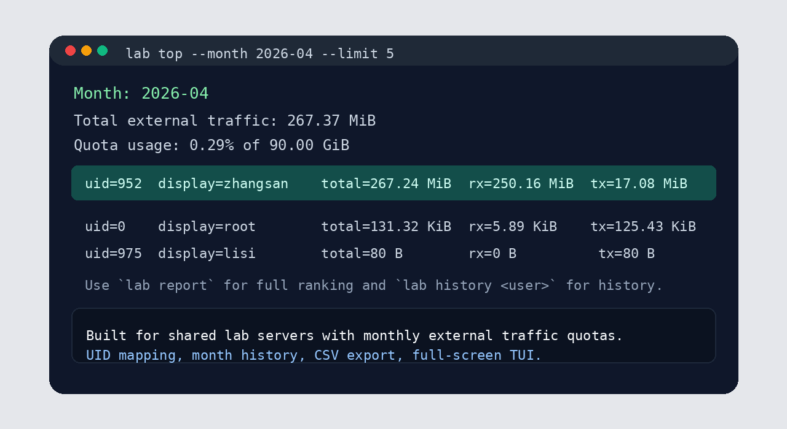

# Labflow - 服务器流量统计 / Per-User Traffic Monitor

实验室共享 Linux 服务器的按用户外网流量统计工具。  
自动识别 `/datas/<用户名>` 目录 owner，对应 UID 计量；支持月度统计、免费时段不计费、历史保留、异常邮件告警、全屏 TUI。

<p align="center">
  
  
  
  
</p>

## 目录

- [这个项目解决什么问题](#这个项目解决什么问题)
- [30 秒看能力](#30-秒看能力)
- [界面预览](#界面预览)
- [适用前提与统计口径](#适用前提与统计口径)
- [3 分钟快速开始](#3-分钟快速开始)
- [命令速查（按任务）](#命令速查按任务)
- [监控界面快捷键](#监控界面快捷键)
- [配置重点](#配置重点)
- [常见排障](#常见排障)
- [文档与仓库结构](#文档与仓库结构)
- [贡献与安全](#贡献与安全)
- [License](#license)

## 这个项目解决什么问题

多人共用服务器时，流量额度通常按整机计算，但管理员需要知道：

- 从每月 1 号到现在，每个用户各用了多少外网流量
- 谁在短时间内出现异常突增
- 月底自动切月统计，历史可追溯

`Labflow` 的目标是：部署一次，日常只要 `lab monitor`。

## 30 秒看能力

- 基于 `nftables` 按 UID 统计外网接口流量（`RX/TX`）
- 自动扫描 `data_root`（默认 `/datas`）并同步用户
- 按自然月聚合，历史月份自动保留
- 支持免费时段不计费（如 `00:00-06:00`）
- 支持 `report/top/history/export-csv/check-quota`
- 支持 `trace`，定位流量峰值附近命令
- 支持单日流量阈值邮件提醒（同用户同日去重）
- 提供全屏 TUI，方向键选择、搜索、导出、切月

## 界面预览

### 全屏监控


### 排行与报表



## 适用前提与统计口径

部署前确认：

- Linux + `Python 3.10+` + `nftables` + `systemd`
- 具备 root 权限（至少执行一次安装脚本）
- 每个用户有独立 UID
- 用户目录结构类似 `/datas/<用户名>`
- 明确外网接口名（如 `eth0`、`ens2f2`）

不适合场景：

- 多人共用同一个 Linux 账号
- 目录 owner 与实际运行任务 UID 长期不一致
- 要求与校园网网关结算字节级完全一致

口径说明：`Labflow` 是本机侧观测，统计“UID 在指定外网接口上的流量”，适合内部审计、排行和预警。

## 3 分钟快速开始

### 1) 克隆并准备配置

```bash
git clone https://github.com/Yichen-Gao/Labflow.git
cd Labflow
cp labflow.example.json labflow.json
PYTHONPATH=src python3 -m labflow --config labflow.json detect-iface
```

### 2) 校验用户识别

```bash
PYTHONPATH=src python3 -m labflow --config labflow.json sync-users
PYTHONPATH=src python3 -m labflow --config labflow.json show-users
```

### 3) 生成并安装 systemd/nftables

```bash
PYTHONPATH=src python3 -m labflow --config labflow.json write-systemd
sudo ./contrib/systemd/generated/install-systemd-root.sh
```

### 4) 安装全局启动命令

```bash
sudo ./contrib/install-system-wide-lab.sh
```

### 5) 打开监控

```bash
lab monitor
```

## 命令速查（按任务）

看本月完整排行：

```bash
lab report
```

只看前 N 名：

```bash
lab top --limit 10
```

看某个用户近几个月趋势：

```bash
lab history zhangsan
```

排查流量峰值附近命令：

```bash
lab trace zhangsan
lab trace zhangsan --around 2026-04-08T17:01:35+08:00 --window-minutes 20
```

导出 CSV：

```bash
lab export-csv --month 2026-04 --output usage-2026-04.csv
```

检查整机月额度：

```bash
lab check-quota
```

手动预演告警邮件：

```bash
lab check-alerts --dry-run
```

## 监控界面快捷键

- `↑/↓` 或 `j/k`：移动选中用户
- `/`：搜索用户名/显示名/UID
- `c`：清空搜索
- `m`：切换月份
- `t`：打开当前用户峰值追踪
- `e`：导出当前月份 CSV
- `u`：导出当前用户历史 CSV
- `r`：刷新
- `q`：退出

提示：若要查看其他用户命令信息，建议管理员使用 `sudo lab monitor`。

## 配置重点

下面是最关键的配置项（`labflow.json`）：

- `data_root`：用户目录根路径（如 `/datas`）
- `external_interfaces`：外网接口
- `timezone`：时区（如 `Asia/Shanghai`）
- `free_traffic_windows`：免费时段（如 `"00:00-06:00"`）
- `exclude_dirs`：共享目录排除列表
- `total_monthly_quota_gb`：整机月总额度
- `user_soft_limit_gb`：单用户软阈值
- `daily_alert_gb`：单日告警阈值
- `alert_email_to`：告警收件邮箱
- `smtp_*`：SMTP 发信参数

如果你是中途才加免费时段配置，可执行：

```bash
lab apply-free-windows
```

该命令会先备份数据库，再清理历史免费时段样本并重建月统计。

## 常见排障

`lab` 在其他用户下找不到：

```bash
sudo ./contrib/install-system-wide-lab.sh
```

检查定时任务是否正常：

```bash
systemctl status labflow-refresh.timer labflow-collect.timer
journalctl -u labflow-collect.service -u labflow-refresh.service -n 50 --no-pager
```

检查规则是否已加载：

```bash
sudo nft list table inet labflow
```

`trace` 看不到命令：先安装审计规则：

```bash
sudo apt install auditd
sudo ./contrib/install-auditd-exec-rules.sh
```

## 文档与仓库结构

文档：

- `docs/INSTALL.md`：完整安装教程
- `docs/ADMIN_COMMANDS.md`：管理员命令速查
- `contrib/systemd/README.md`：systemd 生成文件说明

核心目录：

- `src/labflow/`：核心实现
- `tests/`：测试
- `contrib/`：部署脚本与辅助工具
- `labflow.example.json`：示例配置

## 贡献与安全

- 贡献指南：`CONTRIBUTING.md`
- 安全报告：`SECURITY.md`

## License

MIT
